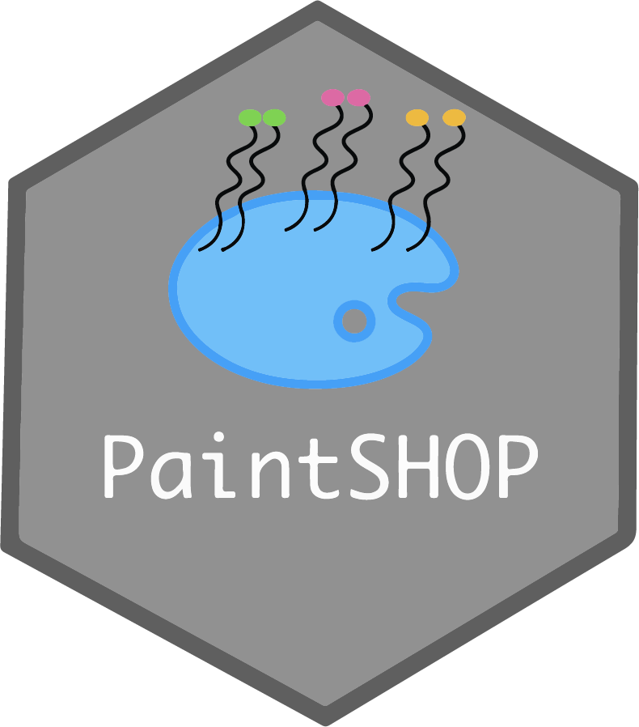

  

# PaintSHOP Overview

PaintSHOP is a technology that enables the interactive design of modern oligonucleotide FISH experiments at genome and transcriptome-scale.

PaintSHOP is comprised of two components:
1. A scalable machine learning pipeline for probe specifity prediction
2. An interactive Shiny web application for probe design

This repository contains the code for the machine learning pipeline.

We provide this open source software without any warranty under the [MIT license](https://opensource.org/licenses/MIT).

A manuscript describing this work is in preparation.

# Description of Pipeline

The pipeline is built to take a set of candidate oligonucleotide (oligo) fluorescent in-situ hybridization (FISH) probes, and generate quantitative predictions about the likelihood of the candidates hybridizing with sequences other than their intended target in the genome. Off-target hybridization results in background noise, and makes FISH signal harder to interpret.

Here is a schematic overview of the pipeline:

  

