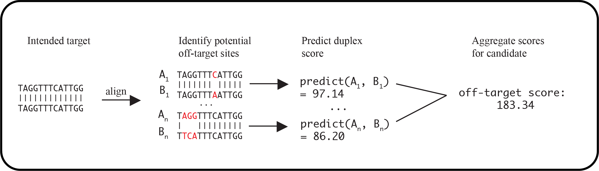

# Pipeline Steps

Description of workflow for the PaintSHOP pipeline.

## Overview

The pipeline consists of three stages:

1. First, several reference files are created including cleaned input files and various indices. 

2. Secondly, the probe design pipeline is run on each chromosome making use of the reference files. 

3. Finally, a set of final output files are generated which constitute the pipeline endpoints.

## 1. Generating reference files

### Parsing the genome

The first step in the workflow is to parse the raw assembly fasta file and discover chromosome names. Based on these names, some records are excluded from `bowtie2` and `jellyfish` indices to prevent wrongly eliminating probes as non-specific based on alignment and k-mer count results. All but presumptive canonical chromosomes are excluded from probe design, according to the following table:

    <table>
        <thead>
            <tr>
                <th align="center">Type</th>
                <th align="center">Identifier</th>
                <th align="center">Example</th>
                <th align="center">Included in indices</th>
                <th align="center">Probes designed</th>
            </tr>
        </thead>
        <tbody>
            <tr>
                <td align="center">Canonical</td>
                <td align="center">*</td>
                <td align="center">chr1</td>
                <td align="center">:heavy_check_mark:</td>
                <td align="center">:heavy_check_mark:</td>
            </tr>
            <tr>
                <td align="center">Unplaced</td>
                <td align="center">Un_</td>
                <td align="center">chrUn_KI270386v1</td>
                <td align="center">:heavy_check_mark:</td>
                <td align="center">:x:</td>
            </tr>
            <tr>
                <td align="center">Unlocalized</td>
                <td align="center">_random</td>
                <td align="center">chr1_KI270708v1_random</td>
                <td align="center">:heavy_check_mark:</td>
                <td align="center">:x:</td>
            </tr>
            <tr>
                <td align="center">Novel sequence</td>
                <td align="center">_alt</td>
                <td align="center">chr1_KZ115747v1_alt</td>
                <td align="center">:x:</td>
                <td align="center">:x:</td>
            </tr>
            <tr>
                <td align="center">Alt. haplotype</td>
                <td align="center">_hap</td>
                <td align="center">chr6_ssto_hap7</td>
                <td align="center">:x:</td>
                <td align="center">:x:</td>
            </tr>
            <tr>
                <td align="center">Fix patch</td>
                <td align="center">_fix</td>
                <td align="center">chr1_KN538361v1_fix</td>
                <td align="center">:x:</td>
                <td align="center">:x:</td>
            </tr>
        </tbody>
    </table>

**NOTE:** Chromosomes not identified as one of these exceptions are presumed to be canonical chromosomes and treated as such. A record of observed chromosome names and their classifications is generated in the pipeline output directory at [01_reference_files/01_chrom_names/](../example_run/expected_pipeline_output/01_reference_files/01_chrom_names/).

This step creates a filtered multi-fasta file for creating `bowtie2` and `jellyfish` indices, as well as individual fasta files for each canonical chromosome for probes to be designed using parallel processing.

### Parsing genome annotations

With canonical chromosomes discovered in the previous step, the provided annotations file is loaded and filtered to include only records where:

* the `seqid` field is identical to one of the presumptive canonical chromosomes

* the `feature` field is equal to `exon`

The remaining records constitute the set of annotations that will be intersected with DNA probes to design the isoform-resolved RNA FISH probes. These annotations are split by chromosome for parallel processing during downstream steps.

### Isoform flattening

For RNA FISH probe design, when it is known which isoform(s) should be targeted, the annotation file is useful as is. However, it is often desireable to obtain RNA FISH probes for a particular target without specifying isoform information. 

For instance, probes designed against an exon that only appears on a very rare isoform, are not likely to be useful against most of the transcripts for this target. To remedy this, this step implements an algorithm to collapse exon annotations to those segments shared by the maximal number of isoforms, when possible. 

This step generates an additional annotation file with isoforms flattened to shared segments. Each of these annotation files is intersected with the DNA probe set to produce the corresponding (isoform-resolved or isoform-flattened) RNA probe set.

### Building bowtie2 and jellyfish indices

After candidate probe sequences are mined from the genome, they are analyzed and scored for efficiency and specificity. As part of this process, candidate probe sequences are aligned to the reference genome using the [Bowtie2](http://bowtie-bio.sourceforge.net/bowtie2/index.shtml) NGS aligner with very sensitive parameters. A k-mer frequency analysis is also performed using the [jellyfish](https://www.cbcb.umd.edu/software/jellyfish/) k-mer counter. Both of these tools require building an index from the genome before querying with candidate probe sequences. 

Both indices are built from the filtered multi-fasta file generated upstream, and when the pipeline is executed on a computing cluster, or multiple cores are provided, these index building steps are executed in parallel to the mining of candidate probe sequences. 

## 2. Probe design pipeline

### Mining candidate probes

Candidate probe sequences are mined from the genome using [OligoMiner](https://github.com/beliveau-lab/OligoMiner) with "newBalance" parameter values. For more information on the mining of candidate probe sequences, see the [OligoMiner publication](https://www.pnas.org/content/115/10/E2183).

### Scoring candidate probes

After mining candidate probe sequences, a series of steps are performed to score candidate sequences for specifity. These steps are described in depth in the [PaintSHOP pre-print](https://www.biorxiv.org/content/10.1101/2020.07.05.188797v1).

Briefly, probes are aligned to the genome using bowtie2, and pairwise alignments are reconstructed using [sam2pairwise](https://github.com/mlafave/sam2pairwise), and k-mer frequency is determined using jellyfish. A gradient boosting regression model implemented with [XGBoost](https://xgboost.readthedocs.io/en/latest/#) generate quantitative predictions about the likelihood of the candidates hybridizing with sequences other than their intended target in the genome using a thermodynamic partition function. These scores are aggregrated into an on-target and off-target score for each probe in the set. Here is a schematic overview of the machine learning pipeline:

  

## 3. Generating output files

### DNA probes

After the pipeline is run on each chromosome, DNA FISH probes exist as per-chromosome .tsv files. These files are merged into a single file which constitutes the DNA FISH probe .tsv output file. This file is also used in subsequent steps. 

### RNA probes 

The merged DNA probes are intersected with both the isoform-resolved and isoform-flattened annotation files, which generates the two RNA probe sets. For more information on these probe sets, see the [output file specification](./pipeline_output.md).

### Zip archives

Each of the three completed probe sets are also compressed into zip archives for convenience. These are the files that end up as downloads in the [PaintSHOP Resources](https://github.com/beliveau-lab/PaintSHOP_resources) repo. These three compressed files contain the complete set of generated DNA and RNA FISH probes.
