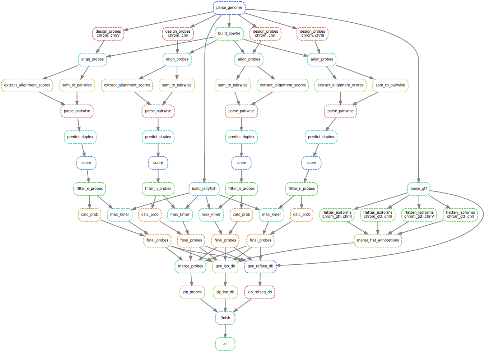

# Expected Pipeline Output

For a detailed description of pipeline output, see the [documentation](../../docs/pipeline_output.md)

### Overview

Pipeline outputs are organized into three directories:

| Folder        | Description                                                       |
|---------------|-------------------------------------------------------------------|
| [01_reference_files/](./01_reference_files)   | files that may be of use in other pipelines or analyses |
| [02_intermediate_files/](./02_intermediate_files)  | large intermediate files, useful when debugging, but otherwise disposable |
| [03_output_files/](./03_output_files) | all DNA/RNA probe sets as both .tsv files and zip archives |

All unwanted files can be safely deleted once the pipeline is run. To minimize disk usage, it may be desirable to keep only the three zip archives found in [03_output_files/04_zip_archives/](./03_output_files/04_zip_archives).

### Probes

Designed FISH probes are in the following locations:

| Item        | Location                                                       |
|---------------|-------------------------------------------------------------------|
| DNA FISH probes in .tsv format | [03_output_files/01_dna_probes/](./03_output_files/01_dna_probes) | 
| Isoform-resolved RNA FISH probes in .tsv format | [03_output_files/02_rna_probes_all/](./03_output_files/02_rna_probes_all) |
| Isoform-flattened RNA FISH probes in .tsv format | [03_output_files/03_rna_probes_iso/](./03_output_files/03_rna_probes_iso) |
| All DNA/RNA FISH probe sets as compressed .zip archives | [03_output_files/04_zip_archives/](./03_output_files/04_zip_archives) |

### Reporting

An HTML report with diagnostics and detailed pipeline information can by generated with the following command:

```
$ snakemake --snakefile path/to/Snakefile --configfile path/to/config.yml --report pipeline_output/report.html
```

An example report is available [here](https://paintshop-bucket.s3.amazonaws.com/static/report.html). For a visualization of the pipeline DAG structure, see: [pipeline.pdf](./pipeline.pdf) or [pipeline.svg](./pipeline.svg)

<div align="center">
    <a href="#Reporting"></a>
</div>
